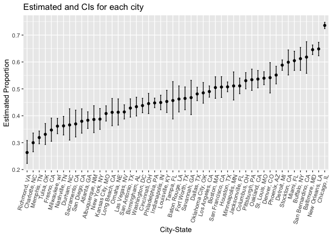

HW5
================
Junyi Ren

``` r
library(tidyverse)
```

    ## ── Attaching core tidyverse packages ──────────────────────── tidyverse 2.0.0 ──
    ## ✔ dplyr     1.1.3     ✔ readr     2.1.4
    ## ✔ forcats   1.0.0     ✔ stringr   1.5.0
    ## ✔ ggplot2   3.4.3     ✔ tibble    3.2.1
    ## ✔ lubridate 1.9.2     ✔ tidyr     1.3.0
    ## ✔ purrr     1.0.2     
    ## ── Conflicts ────────────────────────────────────────── tidyverse_conflicts() ──
    ## ✖ dplyr::filter() masks stats::filter()
    ## ✖ dplyr::lag()    masks stats::lag()
    ## ℹ Use the conflicted package (<http://conflicted.r-lib.org/>) to force all conflicts to become errors

``` r
library(broom)
set.seed(1)
```

## Problem 1

``` r
homicides = read_csv("./homicide-data.csv")
```

    ## Rows: 52179 Columns: 12
    ## ── Column specification ────────────────────────────────────────────────────────
    ## Delimiter: ","
    ## chr (9): uid, victim_last, victim_first, victim_race, victim_age, victim_sex...
    ## dbl (3): reported_date, lat, lon
    ## 
    ## ℹ Use `spec()` to retrieve the full column specification for this data.
    ## ℹ Specify the column types or set `show_col_types = FALSE` to quiet this message.

``` r
homicides_raw_data = homicides |>
  mutate(city_state = paste(city, state, sep=", ")) |>
   group_by(city_state) |>
   summarize(
    Total_Homicides = n(),  
    Unsolved_Homicides = sum(disposition %in% c('Closed without arrest', 'Open/No arrest'), na.rm = TRUE)
  )
```

The homicides raw data consist 12 variables and 52179 observations. Each
observation includes uid, reported date, victim first and last name,
race, age, sex, city, state, lat, lon, and disposition.

``` r
Baltimore = homicides |>
   mutate(city_state = paste(city, state, sep=", ")) |>
   group_by(city_state) |>
  filter(city_state == "Baltimore, MD")

prop_test_result =
  prop.test(
  sum(Baltimore$disposition %in% c('Closed without arrest', 'Open/No arrest')),
  nrow(Baltimore))

prop_test_result |>
  broom::tidy() |>
  select(estimate, conf.low, conf.high)
```

    ## # A tibble: 1 × 3
    ##   estimate conf.low conf.high
    ##      <dbl>    <dbl>     <dbl>
    ## 1    0.646    0.628     0.663

``` r
calculate_prop_test = function(city_data) {
  prop_test_result =
    prop.test(
    sum(city_data %in% c('Closed without arrest', 'Open/No arrest')),
    length(city_data)
  )
  tidy_result =
    broom::tidy(prop_test_result) |>
    select(estimate, conf.low, conf.high)
}

result = homicides |>
    mutate(city_state = paste(city, state, sep=", ")) |>
  group_by(city_state) |>
  summarise(prop_test_results = list(calculate_prop_test(disposition))) |>
  unnest(prop_test_results)
```

    ## Warning: There was 1 warning in `summarise()`.
    ## ℹ In argument: `prop_test_results = list(calculate_prop_test(disposition))`.
    ## ℹ In group 49: `city_state = "Tulsa, AL"`.
    ## Caused by warning in `prop.test()`:
    ## ! Chi-squared approximation may be incorrect

``` r
ggplot(result, aes(y = reorder(city_state, estimate), x = estimate, xmin = conf.low, xmax = conf.high)) +
  geom_point() +
  geom_errorbar(width = 0.2) +
  labs(title = "Estimated and CIs for each city",
       y = "City-State",
       x = "Estimated Proportion") +
  theme(axis.text.x = element_text(angle = 75, hjust = 1)) +
  coord_flip()
```

<!-- -->

## Problem 2

``` r
longitudinal_study = 
  list.files("data", full.names = TRUE) |>
  enframe(name = "file_name", value = "path") |>
  mutate(
    obs = path |> map(read_csv),
    arm = str_sub(basename(path), 1, 3),
    subject_id = str_remove_all(basename(path), "\\D") |> 
      as.integer()
  ) |>
  unnest(obs) |>
  select(-file_name, -path) |>
  relocate(arm, subject_id, everything()) |>
  pivot_longer(
    cols = starts_with("week_"),
    names_to = "week",
    values_to = "data"
  ) |>
  mutate(week = str_remove(week, "week_")) |>
  mutate(arm = 
           case_match(
             arm,
             "con" ~ "control",
             "exp" ~ "experimental"))
```

    ## Rows: 1 Columns: 8
    ## ── Column specification ────────────────────────────────────────────────────────
    ## Delimiter: ","
    ## dbl (8): week_1, week_2, week_3, week_4, week_5, week_6, week_7, week_8
    ## 
    ## ℹ Use `spec()` to retrieve the full column specification for this data.
    ## ℹ Specify the column types or set `show_col_types = FALSE` to quiet this message.
    ## Rows: 1 Columns: 8
    ## ── Column specification ────────────────────────────────────────────────────────
    ## Delimiter: ","
    ## dbl (8): week_1, week_2, week_3, week_4, week_5, week_6, week_7, week_8
    ## 
    ## ℹ Use `spec()` to retrieve the full column specification for this data.
    ## ℹ Specify the column types or set `show_col_types = FALSE` to quiet this message.
    ## Rows: 1 Columns: 8
    ## ── Column specification ────────────────────────────────────────────────────────
    ## Delimiter: ","
    ## dbl (8): week_1, week_2, week_3, week_4, week_5, week_6, week_7, week_8
    ## 
    ## ℹ Use `spec()` to retrieve the full column specification for this data.
    ## ℹ Specify the column types or set `show_col_types = FALSE` to quiet this message.
    ## Rows: 1 Columns: 8
    ## ── Column specification ────────────────────────────────────────────────────────
    ## Delimiter: ","
    ## dbl (8): week_1, week_2, week_3, week_4, week_5, week_6, week_7, week_8
    ## 
    ## ℹ Use `spec()` to retrieve the full column specification for this data.
    ## ℹ Specify the column types or set `show_col_types = FALSE` to quiet this message.
    ## Rows: 1 Columns: 8
    ## ── Column specification ────────────────────────────────────────────────────────
    ## Delimiter: ","
    ## dbl (8): week_1, week_2, week_3, week_4, week_5, week_6, week_7, week_8
    ## 
    ## ℹ Use `spec()` to retrieve the full column specification for this data.
    ## ℹ Specify the column types or set `show_col_types = FALSE` to quiet this message.
    ## Rows: 1 Columns: 8
    ## ── Column specification ────────────────────────────────────────────────────────
    ## Delimiter: ","
    ## dbl (8): week_1, week_2, week_3, week_4, week_5, week_6, week_7, week_8
    ## 
    ## ℹ Use `spec()` to retrieve the full column specification for this data.
    ## ℹ Specify the column types or set `show_col_types = FALSE` to quiet this message.
    ## Rows: 1 Columns: 8
    ## ── Column specification ────────────────────────────────────────────────────────
    ## Delimiter: ","
    ## dbl (8): week_1, week_2, week_3, week_4, week_5, week_6, week_7, week_8
    ## 
    ## ℹ Use `spec()` to retrieve the full column specification for this data.
    ## ℹ Specify the column types or set `show_col_types = FALSE` to quiet this message.
    ## Rows: 1 Columns: 8
    ## ── Column specification ────────────────────────────────────────────────────────
    ## Delimiter: ","
    ## dbl (8): week_1, week_2, week_3, week_4, week_5, week_6, week_7, week_8
    ## 
    ## ℹ Use `spec()` to retrieve the full column specification for this data.
    ## ℹ Specify the column types or set `show_col_types = FALSE` to quiet this message.
    ## Rows: 1 Columns: 8
    ## ── Column specification ────────────────────────────────────────────────────────
    ## Delimiter: ","
    ## dbl (8): week_1, week_2, week_3, week_4, week_5, week_6, week_7, week_8
    ## 
    ## ℹ Use `spec()` to retrieve the full column specification for this data.
    ## ℹ Specify the column types or set `show_col_types = FALSE` to quiet this message.
    ## Rows: 1 Columns: 8
    ## ── Column specification ────────────────────────────────────────────────────────
    ## Delimiter: ","
    ## dbl (8): week_1, week_2, week_3, week_4, week_5, week_6, week_7, week_8
    ## 
    ## ℹ Use `spec()` to retrieve the full column specification for this data.
    ## ℹ Specify the column types or set `show_col_types = FALSE` to quiet this message.
    ## Rows: 1 Columns: 8
    ## ── Column specification ────────────────────────────────────────────────────────
    ## Delimiter: ","
    ## dbl (8): week_1, week_2, week_3, week_4, week_5, week_6, week_7, week_8
    ## 
    ## ℹ Use `spec()` to retrieve the full column specification for this data.
    ## ℹ Specify the column types or set `show_col_types = FALSE` to quiet this message.
    ## Rows: 1 Columns: 8
    ## ── Column specification ────────────────────────────────────────────────────────
    ## Delimiter: ","
    ## dbl (8): week_1, week_2, week_3, week_4, week_5, week_6, week_7, week_8
    ## 
    ## ℹ Use `spec()` to retrieve the full column specification for this data.
    ## ℹ Specify the column types or set `show_col_types = FALSE` to quiet this message.
    ## Rows: 1 Columns: 8
    ## ── Column specification ────────────────────────────────────────────────────────
    ## Delimiter: ","
    ## dbl (8): week_1, week_2, week_3, week_4, week_5, week_6, week_7, week_8
    ## 
    ## ℹ Use `spec()` to retrieve the full column specification for this data.
    ## ℹ Specify the column types or set `show_col_types = FALSE` to quiet this message.
    ## Rows: 1 Columns: 8
    ## ── Column specification ────────────────────────────────────────────────────────
    ## Delimiter: ","
    ## dbl (8): week_1, week_2, week_3, week_4, week_5, week_6, week_7, week_8
    ## 
    ## ℹ Use `spec()` to retrieve the full column specification for this data.
    ## ℹ Specify the column types or set `show_col_types = FALSE` to quiet this message.
    ## Rows: 1 Columns: 8
    ## ── Column specification ────────────────────────────────────────────────────────
    ## Delimiter: ","
    ## dbl (8): week_1, week_2, week_3, week_4, week_5, week_6, week_7, week_8
    ## 
    ## ℹ Use `spec()` to retrieve the full column specification for this data.
    ## ℹ Specify the column types or set `show_col_types = FALSE` to quiet this message.
    ## Rows: 1 Columns: 8
    ## ── Column specification ────────────────────────────────────────────────────────
    ## Delimiter: ","
    ## dbl (8): week_1, week_2, week_3, week_4, week_5, week_6, week_7, week_8
    ## 
    ## ℹ Use `spec()` to retrieve the full column specification for this data.
    ## ℹ Specify the column types or set `show_col_types = FALSE` to quiet this message.
    ## Rows: 1 Columns: 8
    ## ── Column specification ────────────────────────────────────────────────────────
    ## Delimiter: ","
    ## dbl (8): week_1, week_2, week_3, week_4, week_5, week_6, week_7, week_8
    ## 
    ## ℹ Use `spec()` to retrieve the full column specification for this data.
    ## ℹ Specify the column types or set `show_col_types = FALSE` to quiet this message.
    ## Rows: 1 Columns: 8
    ## ── Column specification ────────────────────────────────────────────────────────
    ## Delimiter: ","
    ## dbl (8): week_1, week_2, week_3, week_4, week_5, week_6, week_7, week_8
    ## 
    ## ℹ Use `spec()` to retrieve the full column specification for this data.
    ## ℹ Specify the column types or set `show_col_types = FALSE` to quiet this message.
    ## Rows: 1 Columns: 8
    ## ── Column specification ────────────────────────────────────────────────────────
    ## Delimiter: ","
    ## dbl (8): week_1, week_2, week_3, week_4, week_5, week_6, week_7, week_8
    ## 
    ## ℹ Use `spec()` to retrieve the full column specification for this data.
    ## ℹ Specify the column types or set `show_col_types = FALSE` to quiet this message.
    ## Rows: 1 Columns: 8
    ## ── Column specification ────────────────────────────────────────────────────────
    ## Delimiter: ","
    ## dbl (8): week_1, week_2, week_3, week_4, week_5, week_6, week_7, week_8
    ## 
    ## ℹ Use `spec()` to retrieve the full column specification for this data.
    ## ℹ Specify the column types or set `show_col_types = FALSE` to quiet this message.

``` r
longitudinal_study |>
  ggplot(aes(x = week, y = data, group = subject_id, color = arm)) +
  geom_line() +
  facet_grid(~ arm) +
  labs(title = "Observations Over Time",
       x = "Week",
       y = "Observation") +
  theme_minimal() 
```

<!-- -->

From week 1 to week 8, the values of the subjects in the experimental
group increased. The values of the control group went up and down with
no significant increase or decrease in values

## Problem 3

``` r
n = 30
sigma = 5
alpha = 0.05
simulations = 5000
mu_values = 0:6

sim_mean = function(n, mu, sigma, simulations) {
  output = vector("list", simulations)
  
  for (i in 1:simulations) {
    data <- rnorm(n, mean = mu, sd = sigma)
    
    t_test_result = t.test(data, mu = 0)
    
    output[[i]] = broom::tidy(t_test_result) |>
      select(estimate, p.value)
  }
  
  do.call(bind_rows, output)
}

results_list = lapply(mu_values, function(mu) {
  sim_mean(n, mu, sigma, simulations) |>
    mutate(true_mu = mu)
})

results_df = bind_rows(results_list)

power_values = results_df |>
  group_by(true_mu) |>
  summarise(power = mean(p.value < alpha))

ggplot(power_values, aes(x = true_mu, y = power)) +
  geom_point() +
  geom_line() +
  labs(title = "Power vs. True Effect Size",
       x = "True Effect Size",
       y = "Power")
```

<!-- -->

As the effect size increases, the power increases.

``` r
avg_estimate_values = results_df |>
  group_by(true_mu) |>
  summarise(avg_estimate = mean(estimate),
            avg_estimate_rej = mean(estimate[p.value < alpha]))


ggplot(avg_estimate_values, aes(x = true_mu, y = avg_estimate, group = 1)) +
  geom_point() +
  geom_line() +
  geom_point(aes(y = avg_estimate_rej), color = "red") +
  labs(title = "Average Estimate vs. True Mean",
       x = "True Mean",
       y = "Average Estimate") 
```

<!-- -->

The red line is the average estimate versus the true average. Mean
estimates are very close to the true mean. The blue line is the mean
estimate of the rejected nulls versus the true mean. When the mean is 0,
1, 2, 3, and 4, the sample means of the rejected nulls are not
approximately equal to the true value of the mean because the power is
not large enough. As the power increases or the effect size increases,
the sample mean estimate will be very close to the mean.
